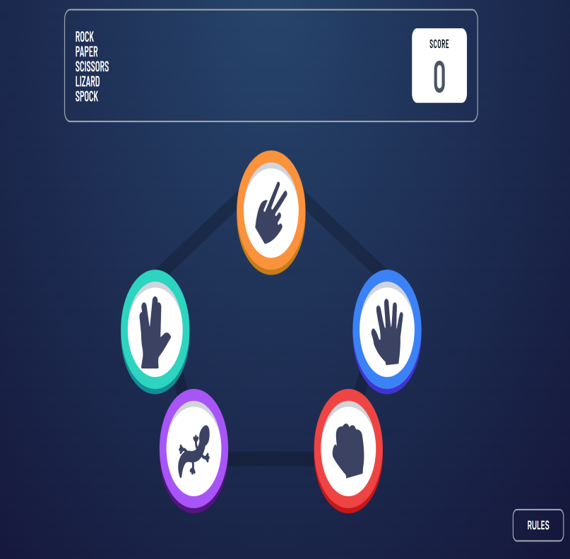
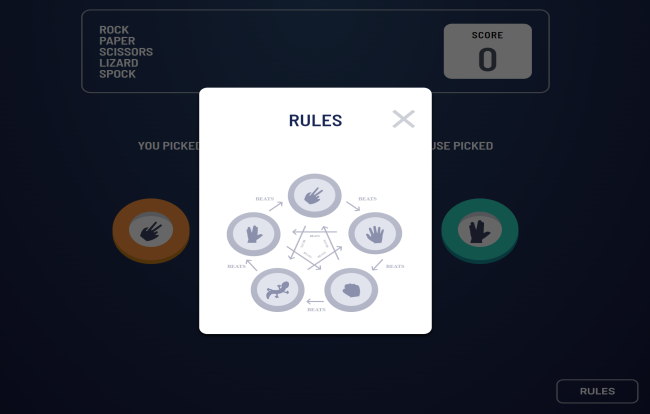

# React Portfolio 

## Table of content
- [Installation](#Installation)
- [Usage](#Usage)
- [License](#License)
- [Author](#Author)
## Description
Rock, paper, scissor, lizard, spock fun browser tapping game.
 [HERE](https://rock-paper-scissors-lac-seven.vercel.app/) You can find my deployed application!
## Screenshots
 
 
### While working on this app I learned
- Practiced writing next.js applications
- Bettered my tailwind abilities
- Practiced writing @keyframes for animations
- Practiced game logic making
## Installation
No need to install when seen in the browser. In local computer npm install needed
## Usage
Play the game by picking your turn and see if you beat the computer. The score adds when you win but careful, when you lose you will loose point too .
## License
GNU General Public License v3.0 is used on this project.

## Author
You can check ou my profiles   [Front-end Mentor](mailto:tiskarechk@gmail.com).  
[Github Profile](https://github.com/FrantiskaAli)
